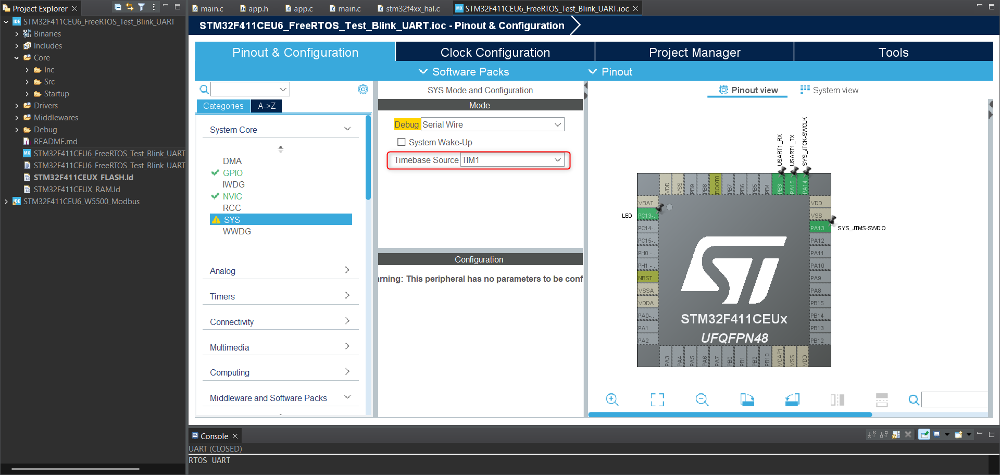
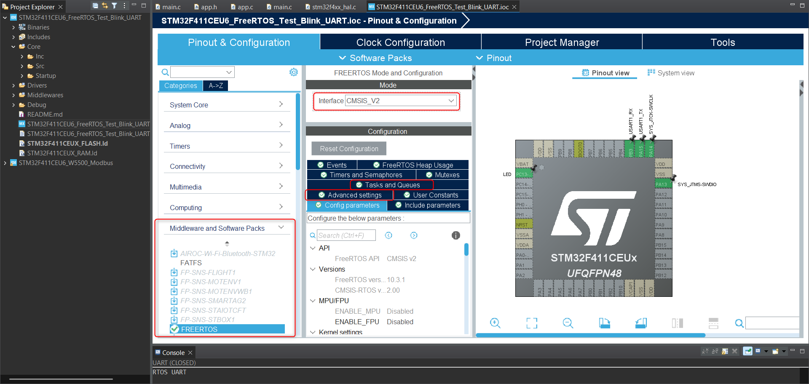
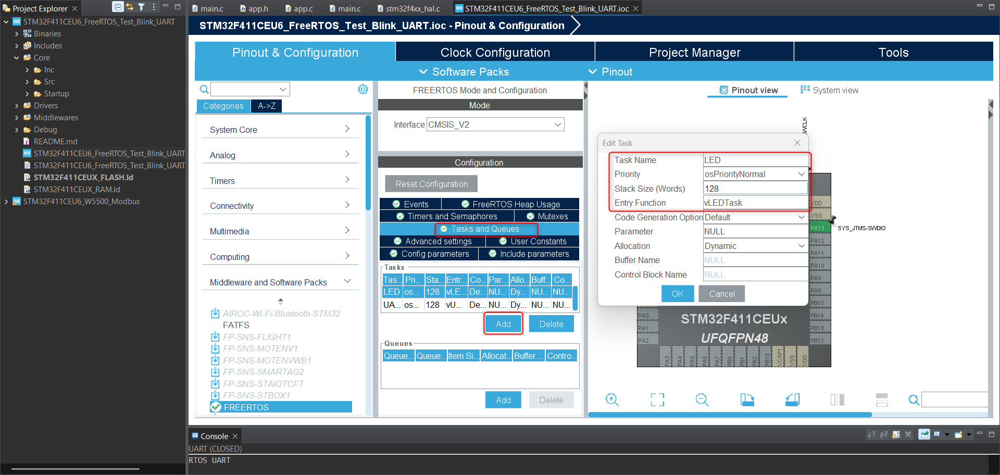
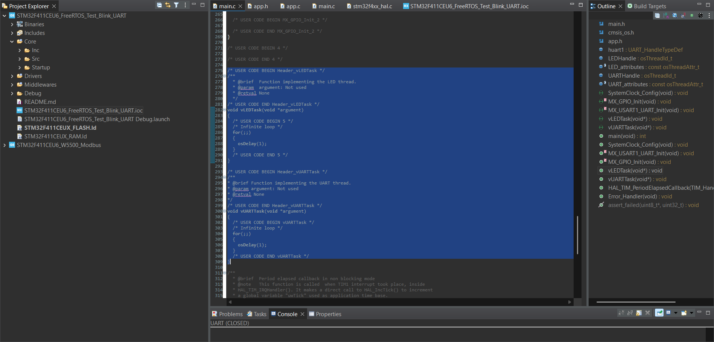

# This project aims to provide hands-on experience with the FreeRTOS operating system. It implements periodic LED blinking and simultaneous data transmission via UART using two separate tasks.

### Application Logic (app.c / app.h)

All operational logic is contained within the app.c and app.h files. Location: STM32F411CEU6_FreeRTOS_Test/Core/Src and Inc.
The following functions have been implemented within `app.c` to handle the core logic of the system:

* **`vLEDTask`**: Responsible for the periodic toggling (blinking) of the onboard LED.
* **`vUARTTask`**: Handles the periodic transmission of data strings via the UART interface.
---

### Setting up FreeRTOS in STM32CubeIDE
First, create a project and configure the basic hardware (e.g. GPIO for the LED and USART1 for communication).

#### Step 1: Timebase Source
FreeRTOS needs to know how much time passes to effectively switch between tasks. It uses the main CPU timer, called `SysTick`. Because of this, we must take the SysTick timer away from the HAL library and assign it to FreeRTOS.

1. In the left menu, go to **System Core -> SYS**.
2. Find the **Timebase Source** field. Change it from `SysTick` to any other available hardware timer, for example, **TIM11**.

#### Step 2: Enabling FreeRTOS & Thread Safety
1. From the left menu, select **Middleware and Software Packs -> FREERTOS**.
2. In the top window, under the *Interface* section, change the option from `Disable` to **CMSIS_V2** (the modern, recommended standard for new projects).
3. **Crucial Setting:** Go to the **Advanced Settings** tab. Find the **USE_NEWLIB_REENTRANT** option and set it to **Enabled**. 
*( This allocates separate memory areas for each task, ensuring that standard C library functions—like `strlen` or `sprintf`—do not crash the system when multiple tasks try to use them at the same time).*

#### Step 3: Creating Tasks (Tasks and Queues)
Now tell the operating system what it should run in parallel.

1. Scroll down in the FreeRTOS configuration window and select the **Tasks and Queues** tab.
2. Double-click the existing default task named `defaultTask`.
3. Change its **Task Name** to `LED` and change its **Entry Function** to `vLEDTask`.
4. Click the **Add** button to create a second task. Name it `UART` and set its **Entry Function** to `vUARTTask`.

**Important Task Parameters Explained:**
* **Priority:** Leave both tasks at `osPriorityNormal`. In RTOS, a higher priority task will instantly interrupt a lower priority one. Since blinking an LED and sending standard UART messages are not time-critical, normal priority is perfect.
* **Stack Size:** Default value is `128` words. For tasks involving large string processing or complex mathematical operations, increasing the stack size to `256` or `512` is recommended to ensure system stability and prevent stack overflows.

#### Step 4: Code Generation & Clean Architecture
1. Click the gear icon on the top bar (or **Project -> Generate Code**) and save the `.ioc` file.
2. Open the generated `main.c` file. 

To maintain project modularity, application logic is kept separate from `main.c`. Follow these steps to set up the environment:
1. Create `app.c` in the `Core/Src` directory and `app.h` in the `Core/Inc` directory.
2. Implement the infinite task loops within `void vLEDTask(void *argument)` and `void vUARTTask(void *argument)` inside `app.c`.
3. Add `#include "app.h"` to the include section at the top of `main.c`.

#### Step 5: Handling "Multiple Definition" Linker Errors
Since the task functions are located in a dedicated `app.c` file, manual management of the auto-generated code is required.

Whenever changes are made to the `.ioc` configuration and code is re-generated, STM32CubeIDE automatically inserts empty function templates for `vLEDTask` and `vUARTTask` at the bottom of `main.c`.

**Important:** These auto-generated empty functions must be manually removed from `main.c` after each code generation. Failure to do so will result in a `Multiple definition` linker error, as the compiler will detect two functions with the same name (one in `main.c` and one in `app.c`).

